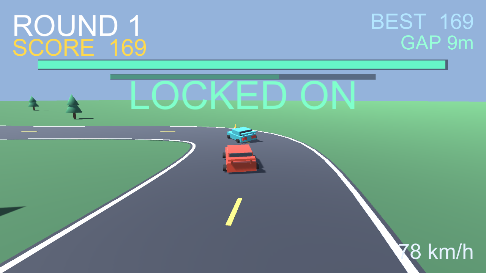

# 🏎️ TANDEM DRIFT

> ライバルのペースカーに張り付き、ドリフトで LOCK メーターをチャージしろ。

ローポリ・スタイルのドリフト追走バトルです。先行するライバルのペースカーのバンパーに張り付きながらドリフトして LOCK メーターをチャージします。離されすぎたり追い抜いたりするとメーターが減り、ゼロになると敗北。ワンタッチのステアリングと、ラウンドごとに激しくなる展開が特徴です。Unity で開発し、WebGL ビルドを GitHub Pages 上でブラウザから直接プレイできます。


🔗 **[Live Demo](https://masafykun.github.io/tandem-drift/)**

---

## 📸 スクリーンショット


---

## 🎮 操作方法
| 操作 | 動作 |
|---|---|
| ← / → | ステアリング（左右） |
| A / D | ステアリング（左右） |
| ホールド＆ドラッグ / タッチ | ステアリング（左右） |

唯一の操作はステアリングのみ。アクセル（スロットル）は自動です。ライバルに近づき、強くスライドするほど LOCK が速く溜まり、スコアも伸びます。

---

## ✨ 特徴
- **追走バトル** — ソロのタイムアタックではなく、ライバルを追走するチェイス形式
- **ワンタッチ操作** — ステアリングのみ、スロットルは自動
- **LOCK メーター** — 近接＋ドリフト強度でチャージ、ゾーンを外れると減少して画面が赤く染まる
- **ラウンド制** — LOCK を 100% まで満たすとラウンドクリア、ボーナス得点
- **ローポリ表現** — 手作業で組み上げたアーケード調のドリフト挙動

---

## 🛠️ 技術スタック
| カテゴリ | 技術 |
|---|---|
| ゲームエンジン | Unity (6000.0.77f1) |
| 言語 | C# |
| 配信ビルド | WebGL |
| ホスティング | GitHub Pages |

C# ソースコードは `src/` に、WebGL ビルドは `Build/` に格納されています。

---

## 🚀 セットアップ
```bash
# このリポジトリは WebGL ビルドを同梱しています。
# ローカルで動かす場合は、簡易 HTTP サーバー経由で index.html を開いてください
# （file:// 直開きでは WebGL が動作しません）。
python3 -m http.server 8000
# ブラウザで http://localhost:8000/ を開く
```

ソースから再ビルドする場合は、`src/` 内の C# スクリプトを Unity (6000.0.77f1) プロジェクトに取り込んでください。

---

## ライセンス

[](https://opensource.org/licenses/MIT)

このプロジェクトは **MIT ライセンス** のもとで公開しています。

© 2026 masafykun (https://github.com/masafykun)
